# Caique Dourado

### Software Engineer · Data Engineer · Growth Hacker · Entrepreneur

Building systems that turn web noise into decisions since 2001.

Founder of [TudoSobreProdutos.com.br](https://www.tudosobreprodutos.com.br) and [SuperNichos](https://supernichos.com). Head of Operations at [Agência Disco](https://www.disco-tec.com) (one of Brazil's leading Shopify agencies). Former CMO at Samurai Experts / Locaweb. Advisory Board Member at ABLEC. Over 25 years hands-on, from Delphi 5 in 2001 to distributed AI pipelines in 2026.

**Python · Next.js · C# · PostgreSQL · Redis · Google BigQuery · n8n**

🇧🇷 Remote from Salvador, Bahia, Brazil

---

## What I do

I build autonomous systems that discover, ingest, normalize, and interpret massive volumes of unstructured web data, turning raw noise into purchasing intelligence and actionable business decisions.

- **Distributed Crawlers & Data Pipelines:** Resilient scraping infrastructure (Playwright, DrissionPage, curl_cffi, Scrapy, httpx) with smart proxy rotation and anti-bot mitigation across 3,600+ stores.
- **Data Engineering & Deduplication:** Cross-merchant catalog clustering without EAN/SKU using Metaphone, Soundex, N-gram, MinHash, and Perceptual Image Hashing.
- **AI, LLMs & NLP at Scale:** Sentiment extraction from millions of reviews, RAG pipelines, multi-provider LLM orchestration (OpenAI, Gemini, Claude), Whisper transcription, YouTube automation, and neural TTS.
- **Programmatic SEO / AEO / GEO:** Data-driven content generation at scale (30M+ pages); structured data, schema markup, technical SEO, Core Web Vitals. Answer Engine Optimization (Perplexity, ChatGPT Search) and Generative Engine Optimization to position content as the canonical source for AI-generated answers.
- **E-commerce Growth & CRO:** A/B testing (GrowthBook, Optimizely), CRM automation (Klaviyo, Insider), GA4, server-side tracking, conversion funnel optimization.
- **High-Performance Modern Web:** Next.js (SSR/SSG, TypeScript) + async Python backends (FastAPI, Redis, Supabase/PostgreSQL, BigQuery).

---

## Selected work

### [TudoSobreProdutos.com.br](https://www.tudosobreprodutos.com.br) (Product intelligence platform, 2020 / re-architected 2026)
The Brazilian equivalent of RTINGS.com and Versus.com, with added coverage of Brazilian retail prices, 3,600+ stores, and local certifications (INMETRO, ANVISA). Brands do not pay for ranking positions.
- End-to-end Data Mining & Generative AI platform with a **17-stage ETL pipeline** from raw scraping to structured portals and multimodal distribution
- 2.8M+ real user reviews processed; catalogs monitored across 3,600+ Brazilian stores
- **Evaluation methodology:** 4-step process: specs screening (manufacturers + global data) → Big Data (cross-referencing thousands of real user reviews and expert video transcripts) → AI Engine (chronic failure patterns and real qualities ignored by other sites) → Human curation (specialists validate every data point for context accuracy); 3 rigour pillars: consolidated social proof, long-term durability metrics (not just out-of-box performance), and normalized technical comparability across price tiers
- Custom deduplication pipeline for cross-merchant product matching without EAN/SKU
- **Human-in-the-Loop (HITL)** editorial system: AI generates, humans validate, platform publishes
- **LLM Ops** (`tiktoken`): long-context management (100k+ tokens), chunking, cost optimization and hallucination mitigation
- **Automated video pipeline** (`Remotion`, `moviepy`, `edge-tts`): LLM-generated scripts feed `Remotion` compositions with neural TTS narration, published to YouTube Shorts & TikTok
- **Frontend:** Next.js 16 App Router + ISR (TTFB ~80-150ms on cache hit); 3-layer cache (`React cache()` + `unstable_cache` + Upstash Redis); deployed on Vercel Edge CDN; `shadcn/ui` + Radix UI
- **Observability:** Sentry (runtime errors), Vercel Analytics, Speed Insights (Core Web Vitals in production)
- **Agent-ready architecture:** `llms.txt`, MCP Server Card, ARD 1.0 catalog, `agent-skills.json`; `Accept: text/markdown` content negotiation via `turndown` (HTML-to-Markdown pipeline); server-side OG image generation via `@napi-rs/canvas`
- **AEO / GEO:** Custom 12-step HTML-to-Markdown pipeline (`lib/markdown-for-agents.ts`) that strips 95%+ of UI noise from Next.js pages for LLM consumption (1.55 MB HTML down to 64 KB Markdown, 86 images deduplicated to 8); `Content-Signal` directives in `robots.txt` (`ai-train=no, search=yes`); canonical attribution header injected into every Markdown response

**System workflow:**

**Live examples:**

| Type | URL |
|:---|:---|
| Product page | [Apple AirPods Pro 3](https://www.tudosobreprodutos.com.br/fones-de-ouvido/apple-airpods-pro-3) |
| Comparison | [AirPods Pro 2 vs AirPods Pro 3](https://www.tudosobreprodutos.com.br/fones-de-ouvido/comparacoes/apple-airpods-pro-2-x-apple-airpods-pro-3) |
| Ranking Top 10 | [Top 4 Apple Headphones](https://www.tudosobreprodutos.com.br/fones-de-ouvido/melhores/top-4-fones-de-ouvido-apple-qual-vale-mais-a-pena) |
| Article | [U-shape vs V-shape vs Neutral Sound](https://www.tudosobreprodutos.com.br/fones-de-ouvido/artigos/assinaturas-sonoras-explicadas-u-shape-vs-v-shape-vs-neutro) |

**Videos generated by the Remotion pipeline:**

| | |
|:---:|:---:|
|  |  |

### [SuperNichos](https://supernichos.com) (Niche & keyword mining tool, 2023-present)
- 700,000 niches and 50M+ keywords in a single platform
- Largest niche discovery and segment mining tool in Brazil

**How it was built:**
1. **Data Ingestion:** Processed the DataForSEO dataset containing 50M search queries from Google Brazil.
2. **Normalization & Clustering:** Normalized search queries and grouped terms to uncover semantic and textual patterns using string similarity algorithms (Metaphone, Soundex, N-gram, MinHash, Fingerprint, NgramKeyer).
3. **Mining & Discovery:** Clustered final data to uncover thousands of profitable niches and market opportunities (for product development, service offerings, addressing unmet customer pain points, and programmatic SEO).

### Agência Disco (Head of Operations, 2023-present)
Shopify e-commerce growth for brands such as Chocolates Dengo, Rommanel, Malwee, CIMED, Garmin, Contém 1G, Bold Snacks, Tânia Bulhões, and 20+ more.
- Growth Marketing, CRO, Programmatic SEO, A/B Testing (GrowthBook)
- CRM & marketing automation (Klaviyo, Insider, Shopify Email, n8n, Shopify Flow)
- GA4, server-side tracking, Customer Events, analytics & BI

### Samurai Experts / Locaweb (CMO & Growth, 2021-2023)
- Chief Marketing Officer, Growth Hacker
- Branding Manager at Wake (wake.tech)

### Editora Juspodivm (Head of E-commerce, 2014-2021, 7+ years)
- Scaled the team from 1 to 8 people; became the largest e-commerce in Brazil's North/Northeast region
- Full ERP + e-commerce platform migration (flipped in a single day in 2016)
- **e-Bit Diamond Seal** (one of only 3 companies in the Brazilian book segment)
- **RA1000** by Reclame Aqui (top reputation seal)
- Stack: Moovin, e-Millennium ERP, Konduto, SendGrid, Maxipago, AWS, Cloudflare, Criteo, Optimizely

| | | |
|:---:|:---:|:---:|
| 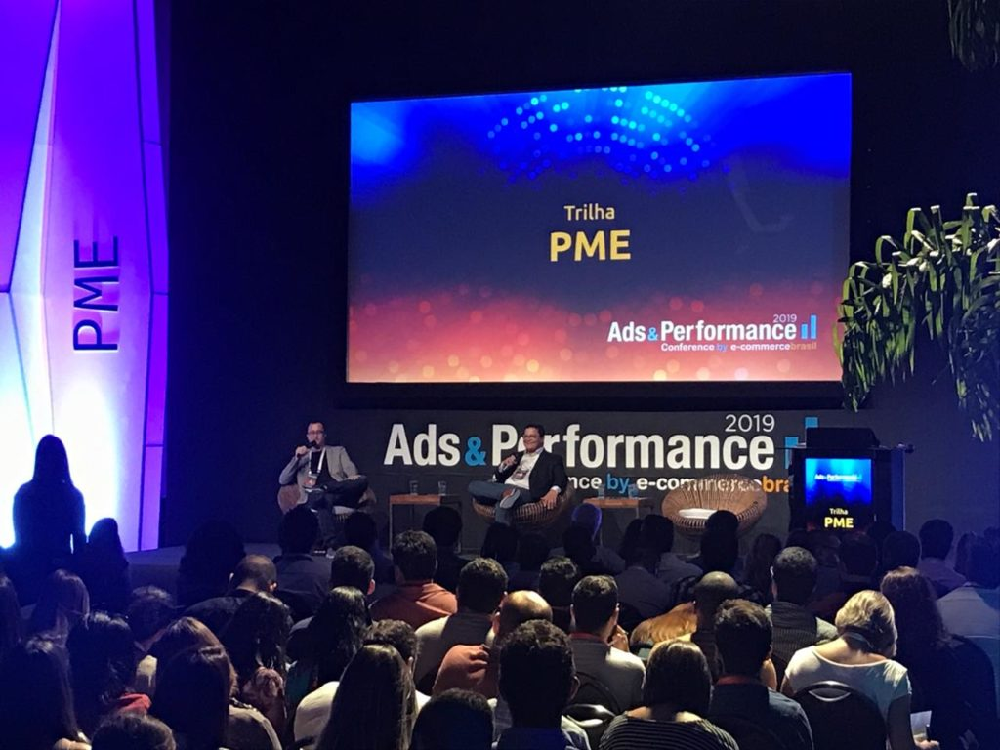 | 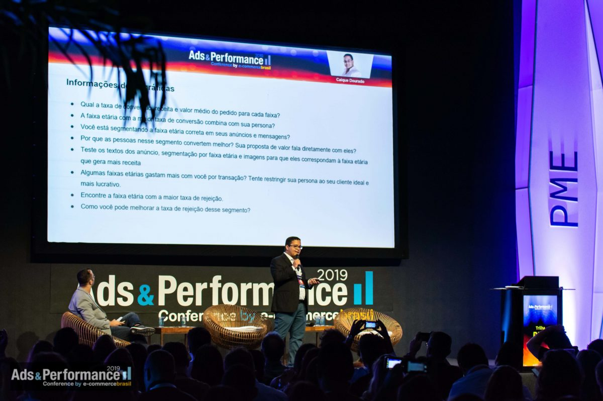 | 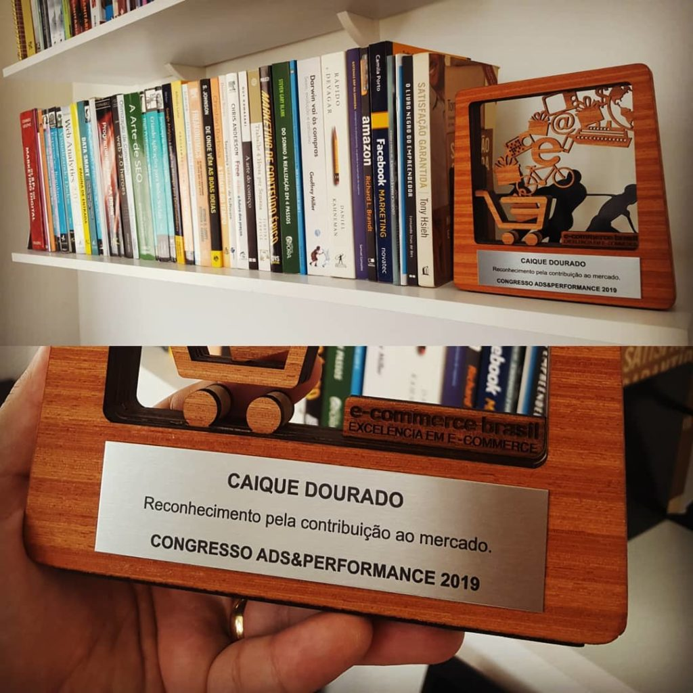 |

### [Google Analytics Real Time Dashboard](https://caiquedourado.com.br/dashboard-em-tempo-real-para-acompanhamento-seu-e-commerce/) (2017)
Real-time analytics and channel monitoring dashboard built for e-commerce operations.
- Real-time traffic, conversion, and acquisition channel monitoring
- Adopted and used by more than 5,000 e-commerce stores

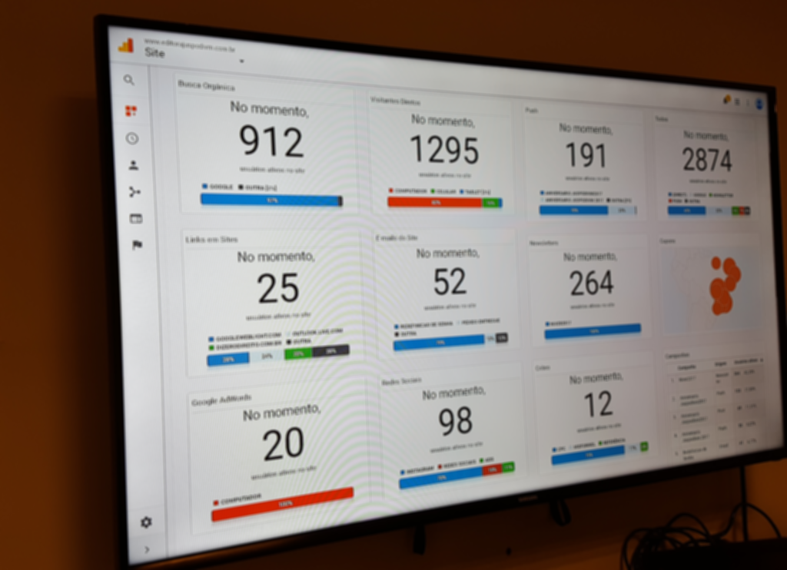

### Cupons VIP (Co-founder & CTO, 2011-2013)
Built from scratch in ASP.NET + SQL Server + Azure (9 months of development, nights and weekends). Acted as CTO and hands-on entrepreneur across all operational and engineering fronts:
- **Product Development:** Full-stack architecture (Frontend, Backend in ASP.NET and SQL Server)
- **Infrastructure & Hosting:** Server management and edge monitoring on Azure CDN and Cloudflare
- **Customer Success:** Scaled support quality to earn the prestigious **RA1000** seal (top reputation on Reclame Aqui)
- **Email Deliverability:** Maintained 99% sender IP reputation across SenderBase, SenderScore, and Microsoft SNDS
- **High-Volume Email Marketing:** Scaled transactional and promotional campaigns to 2M emails/month
- **Growth:** In 1.5 years, grew from 0 to 140,000 monthly pageviews and ~40,000 customers across Salvador, Fortaleza, and Recife; formal partnerships with iBahia and Microsoft Azure

| | |
|:---:|:---:|
| 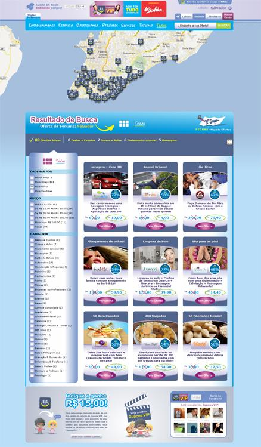 | 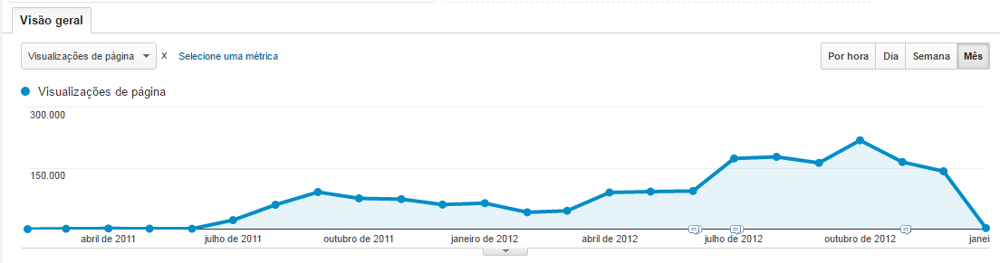 |

### "Baralho do Crime" (2011, viral government project)
- Delivered overnight for Bahia's Public Security Secretary (Pacto pela Vida)
- 10,000 visitors in a single day; covered widely across national press
- Significant media coverage:
  - [G1 / Globo: Segurança Pública da Bahia divulga Baralho do Crime](http://g1.globo.com/bahia/noticia/2011/06/seguranca-publica-da-bahia-divulga-baralho-do-crime.html)
  - [UOL Notícias: Governo da Bahia lança jogo na internet para deter criminosos](http://noticias.uol.com.br/ultimas-noticias/efe/2011/06/03/governo-da-bahia-lanca-jogo-na-internet-para-deter-criminosos.jhtm)

| | |
|:---:|:---:|
|  | 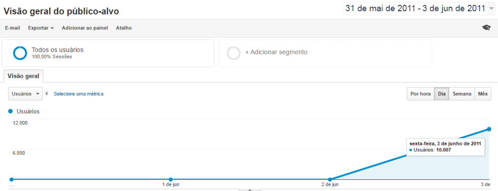 |

### Open Source & Publications
- `Akatus .NET SDK`: Payment gateway integration library
- `Mailee.me .NET SDK`: Email marketing integration library
- Articles: *Criando apps para Orkut com OpenSocial API*, *Push Notifications guide*, *Monitoring ASP.NET errors with appfail.net*

---

## Programmatic SEO Projects

Large-scale programmatic architectures developed since 2020, generating millions of indexed organic pages through autonomous web crawling, catalog entity resolution, NLP sentiment analysis, and serverless edge delivery.

### [Tudo Sobre Produtos - 1st Version](https://web.archive.org/web/20251021032358/https://tudosobreprodutos.com.br/tudo-sobre-bebedouro-cadence-pure-vita-elegant-0v) (2020)
Comprehensive online product intelligence guide with detailed specifications, real user reviews, and comparisons.
- **Scale:** 280,000 products extracted from XML feeds across 4,800 Brazilian e-commerce stores
- **Social proof:** 2,871,096 user reviews collected via Bazaarvoice API
- **Web scraping:** Automated crawler for technical specification sheets across merchant stores
- **Entity resolution challenge:** Clustering 280,000 products from different stores with conflicting naming conventions and missing EAN/SKU
- **Deduplication solution:** Multi-algorithm fuzzy matching on product titles (Metaphone, Soundex, N-gram, MinHash) combined with perceptual image hashing ([ImageHash](https://github.com/coenm/ImageHash))
- **NLP Sentiment extraction:** Pros and Cons generated via sentence splitting with POS Tagger + Sentiment Analysis with Amazon Comprehend ([see architecture presentation](https://docs.google.com/presentation/d/1Y9ShmHLBnlbyZYIlbUPzZ_-QEk0fqIO6UMf-0dZOPQM/edit#slide=id.p))
- **Structured Data:** JSON-LD schemas for FAQ, ItemList, Product, Table, BreadcrumbList, and Article
- **Stack & Architecture:** 100% static HTML generated with C# and SQL Server, deployed to Google Cloud Storage (serverless, infinite scale)
- **Live Archive:** [Visit archived site](https://web.archive.org/web/20251021032358/https://tudosobreprodutos.com.br/tudo-sobre-bebedouro-cadence-pure-vita-elegant-0v)

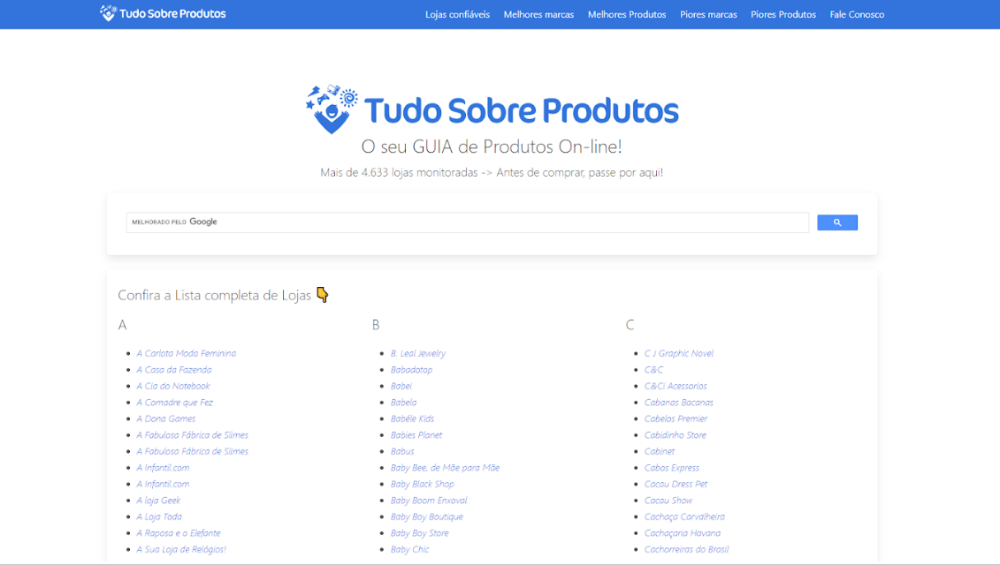

### Portal de Cartórios no Brasil (Brazilian Registry Offices, 2024)
Registry offices directory built for a client, crawling the official "Justiça Aberta" (National Justice Council / CNJ) portal with automated programmatic publishing on WordPress.
- **Scale:** 14,000 programmatic pages generated (one dedicated portal for every registry office in Brazil)
- **Performance:** +900% growth in organic search traffic
- **Crawler:** Custom scraping engine built in C# with HtmlAgilityPack and Fizzler
- **Data enrichment:** Office name, physical address, direct contact info, services offered, notary officer in charge, registered acts, and official annual revenue
- **Publishing pipeline:** SQL Server database with automated ingestion into WordPress via REST API

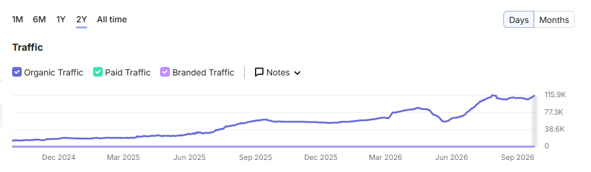

### [Nomes e Sobrenomes](https://web.archive.org/web/20250610174857/https://nomessobrenomes.com/qual-o-significado-do-nome-alan-gustavo) (2023)
Static platform with 90,000 pages covering given name meanings, popularity statistics, and surname ancestry/etymology.
- **Data Sources:** Brazilian Corporate Partners registry (Receita Federal CNPJ database) + IBGE API for historical name frequency
- **AI Content:** OpenAI API (GPT-3.5 Turbo) for structured semantic content generation
- **Visuals:** Programmatic banner and image generation in C#
- **Architecture:** 100% static HTML generated with C# and SQL Server, hosted on Google Cloud Storage (serverless, infinite scale)
- **Performance:** 100% mobile-friendly with perfect Core Web Vitals scores
- **Structured Data:** JSON-LD schemas for FAQ, ItemList, WebSite, Breadcrumbs, and Article
- **Live Archive:** [Visit archived site](https://web.archive.org/web/20250610174857/https://nomessobrenomes.com/qual-o-significado-do-nome-alan-gustavo)

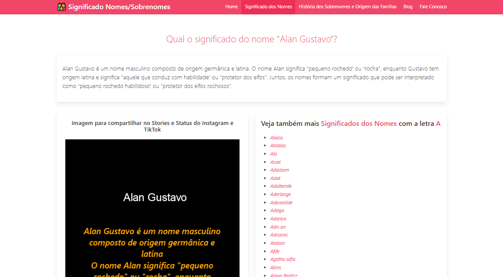

### [Tudo Sobre Lojas](https://web.archive.org/web/20250618081809/https://tudosobrelojas.com/a-loja-saboreat-e-confavel-tudo-sobre-a-loja-saboreat/) (2023)
Comprehensive intelligence and reputational analysis of 63,933 Brazilian e-commerce websites with enriched business data.
- **Coverage:** Scraping and profiling of 63,933 Brazilian online stores
- **Automated Visual Evidence:** Automated headless screenshot generation of Reclame Aqui reputation profiles and store homepages using C# and Selenium
- **Data Enrichment:** Extracted domain owner CNPJ from Whois and cross-referenced with the Federal Revenue database (corporate partners, legal name, trade name, CNPJ, CNAE classification, share capital, physical address, email, phone)
- **Security & Reputation:** Automated SSL certificate verification and direct cross-referencing links to Consumidor.gov.br, Jusbrasil, and Reclame Aqui
- **Platform Detection:** Automatic fingerprinting of e-commerce platforms (Shopify, VTEX, WooCommerce, Nuvemshop, etc.)
- **AI Synthesis:** Contextual explanatory content generated via OpenAI API
- **Live Archive:** [Visit archived site](https://web.archive.org/web/20250618081809/https://tudosobrelojas.com/a-loja-saboreat-e-confavel-tudo-sobre-a-loja-saboreat/)

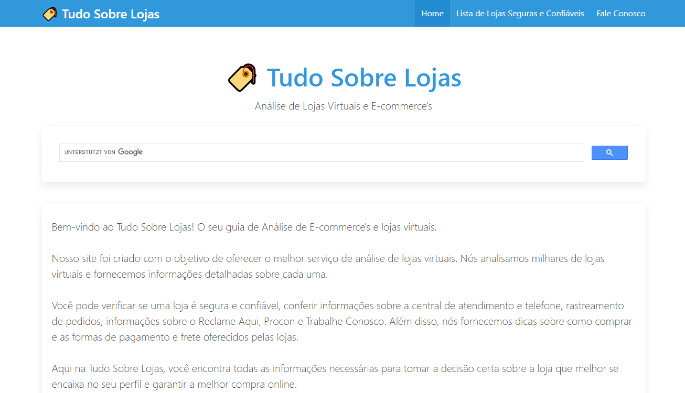

### [Tudo sobre as Palavras](https://web.archive.org/web/20250923215535/https://tudosobreaspalavras.com/tudo-sobre-a-palavra-arrogado) (2023)
Comprehensive Portuguese dictionary platform with 187,000 words, including definitions, synonyms, grammar analysis, and educational exercises.
- **Scale:** 187,000 programmatic pages generated (one for every dictionary entry) combining a pt-BR lexical database with OpenAI API content generation
- **Linguistic Metadata:** Idiomatic and regional definitions, synonyms, antonyms, phonetics and pronunciation, grammatical class, consonants, vowels, root/stem, syllabic division, tonic syllable, singular/plural, gender forms, verb conjugations (infinitive, gerund, past participle), letter counts, educational games, rhymes, and usage examples
- **Visuals:** Dynamic banner and educational graphic generation in C#
- **Architecture:** 100% static HTML generated with C# and SQL Server, hosted on Google Cloud Storage (serverless, infinite scale)
- **Performance:** 100% mobile-friendly with perfect Core Web Vitals scores and JSON-LD schemas
- **Live Archive:** [Visit archived site](https://web.archive.org/web/20250923215535/https://tudosobreaspalavras.com/tudo-sobre-a-palavra-arrogado)

### [Versiculo-Do-Dia.com](https://versiculo-do-dia.com/) (2022)
Bible verse platform with automated programmatic shareable graphics designed for social media distribution.
- **Automated Graphics:** Programmatic generation of high-resolution Bible verse images formatted for social media sharing (Instagram, Facebook, WhatsApp)
- **Database:** Full relational Bible database
- **Engine:** Dynamic image rendering engine in C#
- **Architecture:** 100% static HTML platform hosted on Google Cloud Storage
- **Live Site:** [Visit site](https://versiculo-do-dia.com/)

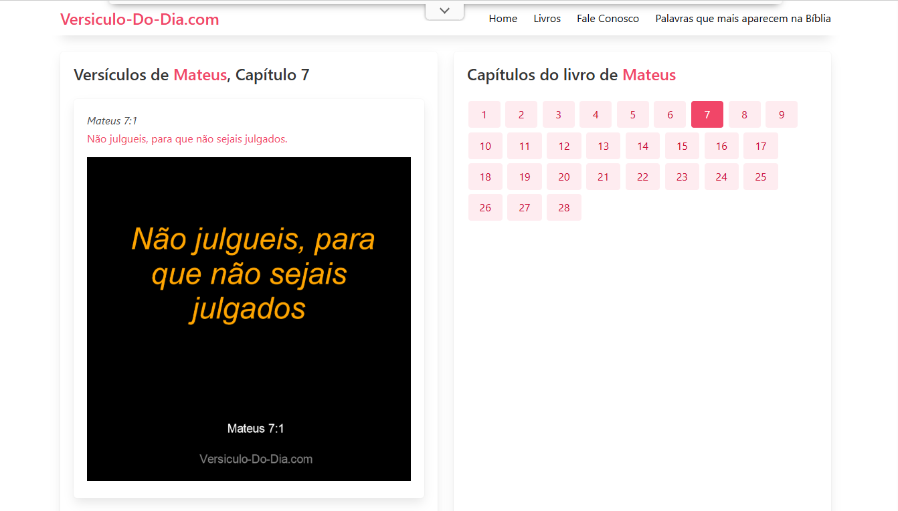

### [919Apps.com](https://web.archive.org/web/20211203115104/https://919apps.com/lca/download-app-mhs-schedule) (2022)
Programmatic discovery catalog generated from the Apple Enterprise Partner Feed (EPF), indexing 2.4 million apps.
- **Scale:** 2.4M apps ingested and indexed from the official Apple Enterprise Partner Feed
- **Internationalization:** Multi-language catalog published across 176 countries
- **Regionalization:** Advanced cultural and geographic formatting implemented using C# `System.Globalization.CultureInfo` and `System.Globalization.RegionInfo`
- **Live Archive:** [Visit archived site](https://web.archive.org/web/20211203115104/https://919apps.com/lca/download-app-mhs-schedule)

---

---

## Keynotes & Talks

### [Congresso E-Commerce Brasil Ads & Performance 2019](https://caiquedourado.com.br/congresso-e-commerce-brasil-adsperformance-2019-google-analytics-como-estruturar-quais-indicadores-medir-e-que-decisoes-tomar-partir-deles/)
*Google Analytics: Como estruturar, quais indicadores medir e que decisões tomar a partir deles?*

Keynote delivered to hundreds of e-commerce leaders on web analytics architecture, metric structuring, conversion funnels, and data-driven decision making.

---

## Recognition

- 🏆 **E-Commerce Brasil Award 2019:** Professional of the Year, Sales Category
- 🎤 **Speaker** at E-Commerce Brasil Ads & Performance Congress 2019 (Google Analytics)
- 🏅 **e-Bit Diamond Seal:** Editora Juspodivm (top 3 in Brazilian book segment)
- ⭐ **RA1000** by Reclame Aqui (Cupons VIP + Juspodivm)
- 🤝 **Advisory Board Member** at ABLEC (Brazilian E-Commerce Retailers Association, 2019-2022)
- 📚 **Member** of Academia E-Commerce Brasil (2020)

---

## Education & Certifications

- Growth Leaders Academy: Growth Hacking (2021)
- FIB: Computer Science / Systems Analysis (2007)
- Google Analytics · Google AdWords (Search & Shopping) · SEMrush Academy · e-Millennium ERP

---

## Beyond Code

When not architecting pipelines or analyzing data, I play electric bass. I run a YouTube channel with over 100 recorded bass covers: [youtube.com/@CaiqueDourado](https://www.youtube.com/@CaiqueDourado/videos).

---

## Let's connect

- 🌐 [tudosobreprodutos.com.br](https://www.tudosobreprodutos.com.br)
- 💼 [linkedin.com/in/caiquedourado](https://www.linkedin.com/in/caiquedourado/)
- ✉️ [contato@tudosobreprodutos.com.br](mailto:contato@tudosobreprodutos.com.br)
- 🐦 [@caiquedourado](https://twitter.com/caiquedourado)
- 📝 [caiquedourado.com.br](https://caiquedourado.com.br)

Software engineer, entrepreneur, bassist, and voracious reader. Mining web data and turning chaos into structure since 2001.

---

🇧🇷 Versão em Português

# Caique Dourado

### Engenheiro de Software · Engenheiro de Dados · Growth Hacker · Empreendedor

Construindo sistemas que transformam caos em decisão desde 2001.

Fundador do [TudoSobreProdutos.com.br](https://www.tudosobreprodutos.com.br) e da [SuperNichos](https://supernichos.com). Head de Operações na [Agência Disco](https://www.disco-tec.com) (uma das principais agências Shopify do Brasil). Ex-CMO na Samurai Experts / Locaweb. Conselheiro da ABLEC. Mais de 25 anos hands-on, do Delphi 5 em 2001 aos pipelines de IA distribuídos em 2026.

**Python · Next.js · C# · PostgreSQL · Redis · Google BigQuery · n8n**

🇧🇷 Remoto de Salvador, Bahia

---

## O que eu faço

Construo sistemas autônomos que coletam, normalizam e interpretam grandes volumes de dados não estruturados da web, transformando ruído bruto em inteligência de compra e decisões de negócio.

- **Crawlers Distribuídos & Pipelines de Dados:** Infraestrutura de coleta resiliente (Playwright, DrissionPage, curl_cffi, Scrapy, httpx) com evasão inteligente de bloqueios e ingestão massiva de 3.600+ lojas.
- **Engenharia de Dados & Deduplicação:** Agrupamento e reconciliação de produtos sem EAN/SKU via Metaphone, Soundex, N-gram, MinHash, Perceptual Image Hashing.
- **IA, LLMs & NLP em Escala:** Extração de sentimentos em milhões de reviews, pipelines RAG, orquestração multi-provider de LLMs (OpenAI, Gemini, Claude), transcrição com Whisper, automação YouTube, síntese neural de voz.
- **SEO Programático / AEO / GEO:** Geração de conteúdo em larga escala (30M+ páginas), dados estruturados, schema markup, SEO técnico, Core Web Vitals. Answer Engine Optimization (Perplexity, ChatGPT Search) e Generative Engine Optimization para posicionar o conteúdo como fonte canônica em respostas geradas por IA.
- **E-commerce Growth & CRO:** Testes A/B (GrowthBook, Optimizely), automação de CRM (Klaviyo, Insider), GA4, server-side tracking, otimização de funis de conversão.
- **Arquitetura Web de Alta Performance:** Next.js (SSR/SSG, TypeScript) + backends assíncronos em Python (FastAPI, Redis, Supabase/PostgreSQL, BigQuery).

---

## Projetos em destaque

### [TudoSobreProdutos.com.br](https://www.tudosobreprodutos.com.br) (Motor de inteligência de produtos, 2020 / relançado em 2026)
O equivalente brasileiro do RTINGS.com e Versus.com, com cobertura adicional de preços do varejo brasileiro, 3.600+ lojas e certificações locais (INMETRO, ANVISA). Marcas não pagam por posição nos rankings.
- Plataforma de Data Mining e IA Generativa de ponta a ponta com **ETL de 17 fases**, do scraping bruto a portais estruturados e distribuição multimodal
- Mais de 2,8 milhões de avaliações reais processadas; catálogos monitorados em 3.600+ lojas brasileiras
- **Metodologia de avaliação:** 4 etapas: triagem de specs (fabricantes + dados globais) \u2192 Big Data (cruzamento de reviews reais e transcrições de vídeos de especialistas) \u2192 Motor de IA (padrões de falhas crônicas e qualidades reais ignoradas por outros sites) \u2192 curadoria humana; 3 pilares: prova social consolidada, métricas de durabilidade a longo prazo (não apenas desempenho na caixa) e comparabilidade técnica normalizada entre faixas de preço
- Pipeline próprio de deduplicação para casamento de produtos sem EAN/SKU
- **Human-in-the-Loop (HITL):** IA gera, humanos validam, plataforma publica
- **LLM Ops** (`tiktoken`): gestão de contexto longo (100k+ tokens), chunking, controle de custo e mitigação de alucinações
- **Pipeline de vídeo automatizado** (`Remotion`, `moviepy`, `edge-tts`): roteiros gerados por IA alimentam composições `Remotion` com narração neural, publicados no YouTube Shorts e TikTok
- **Frontend:** Next.js 16 App Router + ISR (TTFB ~80-150ms em cache hit); cache em 3 camadas (`React cache()` + `unstable_cache` + Upstash Redis); deploy na Vercel Edge CDN; `shadcn/ui` + Radix UI
- **Observabilidade:** Sentry (erros em runtime), Vercel Analytics, Speed Insights (Core Web Vitals em produção)
- **Arquitetura agent-ready:** `llms.txt`, MCP Server Card, ARD 1.0, `agent-skills.json`; negociação `Accept: text/markdown` via pipeline `turndown` (HTML para Markdown); geração server-side de imagens OG com `@napi-rs/canvas`
- **AEO / GEO:** Pipeline HTML-to-Markdown de 12 etapas (`lib/markdown-for-agents.ts`) que remove 95%+ do ruído de UI de páginas Next.js para consumo por LLMs (1,55 MB de HTML reduzidos a 64 KB de Markdown, 86 imagens deduplicadas para 8); diretivas `Content-Signal` no `robots.txt` (`ai-train=no, search=yes`); cabeçalho de atribuição canônica injetado em cada resposta Markdown

**Workflow do sistema:**

**Exemplos reais:**

| Tipo | URL |
|:---|:---|
| Página de produto | [Apple AirPods Pro 3](https://www.tudosobreprodutos.com.br/fones-de-ouvido/apple-airpods-pro-3) |
| Comparativo | [AirPods Pro 2 vs AirPods Pro 3](https://www.tudosobreprodutos.com.br/fones-de-ouvido/comparacoes/apple-airpods-pro-2-x-apple-airpods-pro-3) |
| Ranking Top 10 | [Top 4 Fones Apple](https://www.tudosobreprodutos.com.br/fones-de-ouvido/melhores/top-4-fones-de-ouvido-apple-qual-vale-mais-a-pena) |
| Artigo | [U-shape vs V-shape vs Neutro](https://www.tudosobreprodutos.com.br/fones-de-ouvido/artigos/assinaturas-sonoras-explicadas-u-shape-vs-v-shape-vs-neutro) |

**Vídeos gerados pelo pipeline Remotion:**

| | |
|:---:|:---:|
|  |  |

### [SuperNichos](https://supernichos.com) (Mineração de nichos e palavras-chave, 2023-atual)
- 700.000 nichos e 50 milhões de palavras-chave em uma plataforma
- Maior ferramenta de mineração de nichos e segmentos do Brasil

**Como fiz?**
1. **Base de dados:** Ingestão do dataset do DataForSEO com 50M de termos buscados no Google Brasil.
2. **Normalização e agrupamento:** Tratamento e agrupamento dos termos de busca para encontrar padrões textuais e semânticos usando algoritmos de similaridade (Metaphone, Soundex, N-gram, MinHash, Fingerprint, NgramKeyer).
3. **Mineração de oportunidades:** Clusterização dos dados finais para identificar milhares de nichos promissores e oportunidades de mercado (para criação de produtos, oferta de serviços, atendimento de dores de público, etc.).

### Agência Disco (Head de Operações, 2023-atual)
E-commerce e growth para marcas como Chocolates Dengo, Rommanel, Malwee, CIMED, Garmin, Contém 1G, Bold Snacks, Tânia Bulhões e mais de 20 outras.
- Growth Marketing, CRO, SEO Programático, Testes A/B (GrowthBook)
- Automação de CRM e marketing (Klaviyo, Insider, Shopify Email, n8n, Shopify Flow)
- GA4, server-side tracking, Customer Events, analytics e BI

### Samurai Experts / Locaweb (CMO & Growth, 2021-2023)
- Chief Marketing Officer e Growth Hacker
- Gerente de Branding na Wake (wake.tech)

### Editora Juspodivm (Head de E-commerce, 2014-2021, 7+ anos)
- Criou e escalou o setor de 1 para 8 profissionais; tornou-se o maior e-commerce do Norte/Nordeste do Brasil
- Migração completa de ERP + plataforma de e-commerce (virada em um único dia em 2016)
- **Selo Diamante e-Bit** (uma das 3 empresas do segmento de livros no Brasil)
- **RA1000** pelo Reclame Aqui (melhor reputação)
- Stack: Moovin, e-Millennium ERP, Konduto, SendGrid, Maxipago, AWS, Cloudflare, Criteo, Optimizely

| | | |
|:---:|:---:|:---:|
|  |  |  |

### [Google Analytics Real Time Dashboard](https://caiquedourado.com.br/dashboard-em-tempo-real-para-acompanhamento-seu-e-commerce/) (2017)
Criação de dashboard em tempo real para acompanhamento de canais e tráfego em e-commerce.
- Monitoramento em tempo real de visitantes, canais de aquisição e conversões
- Utilizado por mais de 5.000 lojas virtuais

### Cupons VIP (Co-fundador & CTO, 2011-2013)
Construído do zero em ASP.NET + SQL Server + Azure (9 meses, noites e fins de semana). Atuava como CTO e empreendedor faz-tudo:
- **Desenvolvimento de Produto:** Full-stack (Frontend, Backend em ASP.NET e SQL Server)
- **Hospedagem e Monitoramento:** Gestão de servidores, CDN Azure e Cloudflare
- **Atendimento e Reputação:** Conquista do selo **RA1000** (melhores empresas no Reclame Aqui)
- **Entregabilidade de E-mails:** Reputação dos IPs de envio em 99% no SenderBase, SenderScore e Microsoft SNDS
- **E-mail Marketing em Escala:** Disparo de campanhas e e-mails transacionais para 2 milhões de e-mails/mês
- **Crescimento:** Em 1 ano e meio, saímos do zero para 140.000 visualizações de páginas mensais e aproximadamente 40.000 clientes em Salvador, Fortaleza e Recife; parcerias com iBahia e Microsoft Azure

| | |
|:---:|:---:|
|  |  |

### "Baralho do Crime" (2011, projeto viral para o Governo da Bahia)
- Entregue da noite para o dia para a Secretaria de Segurança Pública (Pacto pela Vida)
- 10.000 visitantes em um único dia; grande repercussão na imprensa nacional
- Repercussão na mídia:
  - [G1 / Globo: Segurança Pública da Bahia divulga Baralho do Crime](http://g1.globo.com/bahia/noticia/2011/06/seguranca-publica-da-bahia-divulga-baralho-do-crime.html)
  - [UOL Notícias: Governo da Bahia lança jogo na internet para deter criminosos](http://noticias.uol.com.br/ultimas-noticias/efe/2011/06/03/governo-da-bahia-lanca-jogo-na-internet-para-deter-criminosos.jhtm)

| | |
|:---:|:---:|
|  |  |

### Open Source & Publicações
- `Akatus .NET SDK`: Biblioteca de integração para gateway de pagamento
- `Mailee.me .NET SDK`: Biblioteca de integração para e-mail marketing
- Artigos: *Criando apps para Orkut com OpenSocial API*, *Guia completo de Push Notifications*, *Monitorando erros ASP.NET com appfail.net*

---

## Projetos de SEO Programático

Arquiteturas programáticas de grande escala desenvolvidas desde 2020, gerando milhões de páginas orgânicas bem posicionadas por meio de coleta autônoma de dados, normalização de catálogos, análise de NLP e entrega serverless estática.

### [Tudo Sobre Produtos (1ª Versão)](https://web.archive.org/web/20251021032358/https://tudosobreprodutos.com.br/tudo-sobre-bebedouro-cadence-pure-vita-elegant-0v) (2020)
Guia completo de produtos online com informações detalhadas, reviews e comparações.
- **Escala:** 280 mil produtos obtidos no Feed XML de 4.800 lojas brasileiras diferentes
- **Prova social:** 2.871.096 avaliações reais obtidas da API Bazaarvoice
- **Web scraping:** Crawler de ficha técnica dedicado nas diversas lojas
- **Desafio de resolução de entidades:** Agrupar 280 mil produtos de diferentes lojas, com nomenclaturas distintas e muitos sem EAN/SKU
- **Solução de deduplicação:** Algoritmos de similaridade fonética e de texto (Metaphone, Soundex, N-gram, MinHash) combinados com [perceptual image hashing](https://github.com/coenm/ImageHash)
- **Extração de NLP:** Prós e Contras gerados a partir da divisão de sentenças com POS Tagger + análise de sentimentos com Amazon Comprehend ([veja a apresentação do processo](https://docs.google.com/presentation/d/1Y9ShmHLBnlbyZYIlbUPzZ_-QEk0fqIO6UMf-0dZOPQM/edit#slide=id.p))
- **Dados estruturados:** Schemas JSON-LD de FAQ, ItemList, Product, Table, BreadcrumbList e Article
- **Arquitetura & Stack:** 100% em HTML estático gerado em C#, banco SQL Server e hospedado no Google Cloud Storage (serverless, escalabilidade infinita)
- **Arquivo histórico:** [Conheça o site arquivado](https://web.archive.org/web/20251021032358/https://tudosobreprodutos.com.br/tudo-sobre-bebedouro-cadence-pure-vita-elegant-0v)

### Portal de Cartórios no Brasil (2024)
Desenvolvido para um cliente. Crawler de cartórios no portal Justiça Aberta (CNJ), com geração de páginas programáticas no WordPress.
- **Escala:** 14 mil páginas geradas (uma página dedicada para cada cartório no Brasil)
- **Impacto:** Aumento de 900% nas visitas orgânicas
- **Crawler:** Construído em C# com HtmlAgilityPack e Fizzler
- **Dados enriquecidos por cartório:** Nome do cartório, endereço físico, dados de contato, serviços oferecidos, dados do cartorário responsável, atos praticados e arrecadação oficial
- **Pipeline:** Banco SQL Server com publicação automatizada via WordPress REST API

### [Nomes e Sobrenomes](https://web.archive.org/web/20250610174857/https://nomessobrenomes.com/qual-o-significado-do-nome-alan-gustavo) (2023)
Site estático com 90.000 páginas sobre significados de nomes, estatísticas e história dos sobrenomes.
- **Fontes de dados:** Base de sócios de empresas brasileiras (CNPJ da Receita Federal) + API de dados do IBGE para estatísticas e distribuição de nomes
- **IA Generativa:** API OpenAI (GPT-3.5 Turbo) para geração do conteúdo semântico
- **Geração visual:** C# para geração programática das imagens e banners
- **Arquitetura:** 100% em HTML estático gerado em C#, banco SQL Server e hospedagem no Google Cloud Storage (serverless, escalabilidade infinita)
- **Performance:** 100% adequado a dispositivos móveis com notas perfeitas no Web Vitals
- **Dados estruturados:** Schemas JSON-LD de FAQ, ItemList, WebSite, Breadcrumbs e Article
- **Arquivo histórico:** [Conheça o site arquivado](https://web.archive.org/web/20250610174857/https://nomessobrenomes.com/qual-o-significado-do-nome-alan-gustavo)

### [Tudo Sobre Lojas](https://web.archive.org/web/20250618081809/https://tudosobrelojas.com/a-loja-saboreat-e-confavel-tudo-sobre-a-loja-saboreat/) (2023)
Análise completa de lojas virtuais e e-commerces brasileiros com dados enriquecidos de reputação e cadastro.
- **Escala:** Scraping e análise de 63.933 lojas brasileiras
- **Evidências visuais automáticas:** Geração de screenshots da página da loja no Reclame Aqui e da homepage da loja usando C# e Selenium
- **Enriquecimento cadastral:** Extração do CNPJ no Whois e cruzamento com a base de CNPJ da Receita Federal (sócios, razão social, nome fantasia, CNPJ, CNAE, capital social, endereço, e-mail, telefone)
- **Segurança & Reputação:** Checagem automatizada de certificado SSL e links diretos para busca de reclamações no Consumidor.gov.br, Jusbrasil e Reclame Aqui
- **Identificação de tecnologia:** Detecção automática da plataforma de e-commerce utilizada (Shopify, VTEX, WooCommerce, Nuvemshop, etc.)
- **IA:** Geração de conteúdo de apoio e síntese explicativa com API da OpenAI
- **Arquivo histórico:** [Conheça o site arquivado](https://web.archive.org/web/20250618081809/https://tudosobrelojas.com/a-loja-saboreat-e-confavel-tudo-sobre-a-loja-saboreat/)

### [Tudo sobre as Palavras](https://web.archive.org/web/20250923215535/https://tudosobreaspalavras.com/tudo-sobre-a-palavra-arrogado) (2023)
Dicionário completo com 187 mil palavras, incluindo significados, sinônimos, gramática e exercícios educativos.
- **Escala:** 187 mil páginas geradas (uma para cada verbete) a partir de banco de dados pt-BR + geração de conteúdo com API da OpenAI
- **Riqueza gramatical:** Significado idiomático e regional, sinônimos, antônimos, ortografia e pronúncia, classe gramatical, consoantes, vogais, radical, separação silábica, sílaba tônica, singular/plural, flexão de gênero, tempos verbais (infinitivo, gerúndio, particípio), contagem de letras, atividades, jogos, rimas e exemplos práticos de uso
- **Imagens:** Geração programática de imagens e artes explicativas em C#
- **Arquitetura:** 100% em HTML estático gerado em C#, banco SQL Server e hospedado no Google Cloud Storage (serverless, escalabilidade infinita)
- **Performance:** 100% adequado a dispositivos móveis, pontuação máxima no Web Vitals e schemas JSON-LD
- **Arquivo histórico:** [Conheça o site arquivado](https://web.archive.org/web/20250923215535/https://tudosobreaspalavras.com/tudo-sobre-a-palavra-arrogado)

### [Versiculo-Do-Dia.com](https://versiculo-do-dia.com/) (2022)
Plataforma de versículos bíblicos com imagens programáticas compartilháveis para redes sociais.
- **Geração de imagens:** Automação de artes de versículos bíblicos formatadas para compartilhamento em redes sociais (Instagram, Facebook, WhatsApp)
- **Base de dados:** Banco relacional completo da Bíblia
- **Motor visual:** Renderizador dinâmico de imagens em C#
- **Arquitetura:** Site 100% estático em HTML hospedado no Google Cloud Storage
- **Site no ar:** [Conheça o site](https://versiculo-do-dia.com/)

### [919Apps.com](https://web.archive.org/web/20211203115104/https://919apps.com/lca/download-app-mhs-schedule) (2022)
Portal programático gerado a partir do Apple Enterprise Partner Feed (EPF), catalogando 2,4 milhões de aplicativos.
- **Escala:** 2,4 milhões de aplicativos indexados diretamente do Apple Enterprise Partner Feed
- **Alcance internacional:** Site multi-idiomas publicado em 176 países
- **Regionalização:** Suporte avançado a internacionalização usando `System.Globalization.CultureInfo` e `System.Globalization.RegionInfo` em C#
- **Arquivo histórico:** [Conheça o site arquivado](https://web.archive.org/web/20211203115104/https://919apps.com/lca/download-app-mhs-schedule)

---

---

## Palestras

### [Congresso E-Commerce Brasil Ads & Performance 2019](https://caiquedourado.com.br/congresso-e-commerce-brasil-adsperformance-2019-google-analytics-como-estruturar-quais-indicadores-medir-e-que-decisoes-tomar-partir-deles/)
*Google Analytics: Como estruturar, quais indicadores medir e que decisões tomar a partir deles?*

Palestra técnica ministrada para centenas de profissionais e lojistas sobre planejamento de métricas no Google Analytics, modelagem de funis de conversão e tomada de decisões analíticas no e-commerce.

---

## Reconhecimentos

- 🏆 **Prêmio E-Commerce Brasil 2019:** Profissional Destaque do Ano, Categoria Vendas
- 🎤 **Palestrante** no Congresso E-Commerce Brasil Ads & Performance 2019 (Google Analytics)
- 🏅 **Selo Diamante e-Bit:** Editora Juspodivm (top 3 no segmento de livros do Brasil)
- ⭐ **RA1000** pelo Reclame Aqui (Cupons VIP + Juspodivm)
- 🤝 **Conselheiro** da ABLEC (Associação Brasileira de Lojistas de E-Commerce, 2019-2022)
- 📚 **Membro** da Academia E-Commerce Brasil (2020)

---

## Formação & Certificações

- Growth Leaders Academy: Growth Hacking (2021)
- FIB: Ciência da Computação / Análise de Sistemas (2007)
- Google Analytics · Google AdWords (Rede de Pesquisa e Shopping) · SEMrush Academy · e-Millennium ERP

---

## Além do Código

Fora dos terminais e dos pipelines de dados, sou contrabaixista. Mantenho um canal no YouTube com mais de 100 covers gravados: [youtube.com/@CaiqueDourado](https://www.youtube.com/@CaiqueDourado/videos).

---

## Vamos conversar

- 🌐 [tudosobreprodutos.com.br](https://www.tudosobreprodutos.com.br)
- 💼 [linkedin.com/in/caiquedourado](https://www.linkedin.com/in/caiquedourado/)
- ✉️ [contato@tudosobreprodutos.com.br](mailto:contato@tudosobreprodutos.com.br)
- 🐦 [@caiquedourado](https://twitter.com/caiquedourado)
- 📝 [caiquedourado.com.br](https://caiquedourado.com.br)

Programador, empreendedor, baixista e leitor voraz. Minerando dados na web e transformando caos em estrutura desde 2001.

  
  &nbsp;&nbsp;
  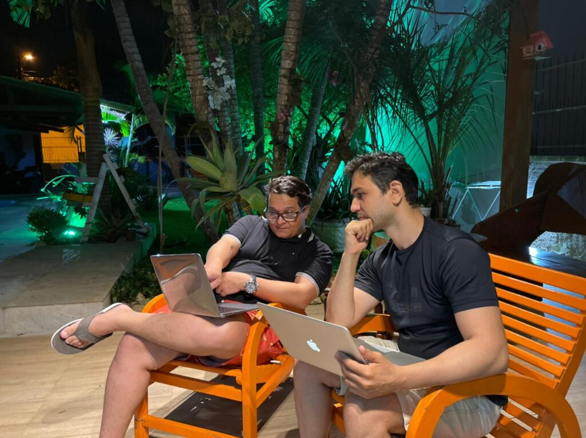

